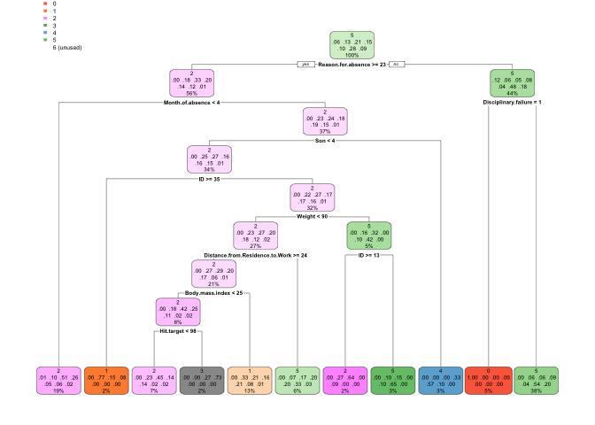

```r
knitr::opts_chunk$set(echo = TRUE)
```

## Importing Required Libraries 

```r
#install.packages("tidyverse", repos = "http://cran.us.r-project.org")
library(tidyverse)
#install.packages("ggplot2", repos = "http://cran.us.r-project.org")
library(ggplot2)
#install.packages("VIM", repos = "http://cran.us.r-project.org")
library(VIM)
#install.packages("plyr", repos = "http://cran.us.r-project.org")
library(plyr)
#install.packages("dplyr", repos = "http://cran.us.r-project.org")
#library(dplyr)
#install.packages("lubridate", repos = "http://cran.us.r-project.org")
library(lubridate)
#install.packages("constants", repos = "http://cran.us.r-project.org")
library(constants)
#install.packages("corrplot", repos = "http://cran.us.r-project.org")
library(corrplot)
#install.packages("rpart", repos = "http://cran.us.r-project.org")
library(rpart)
#install.packages("rpart.plot", repos = "http://cran.us.r-project.org")
library(rpart.plot)
#install.packages("e1071", repos = "http://cran.us.r-project.org")
library(e1071)
#install.packages("devtools", repos = "http://cran.us.r-project.org")
library(devtools) 
```

```
## Error in get(genname, envir = envir) : object 'testthat_print' not found
```

```r
#install.packages("caret", repos = "http://cran.us.r-project.org")
library(caret)
install_github("vqv/ggbiplot")
library(ggbiplot)
#install.packages("randomForest", repos = "http://cran.us.r-project.org")
library(randomForest)
#install.packages("gridExtra", repos = "http://cran.us.r-project.org")
library(gridExtra)
```


## Importing Data Files

```r
train_data <- read.table("/Users/nithyavembu/Downloads/Absenteeism_at_work_train.csv", header=TRUE, sep=",")
test_data <- read.table("/Users/nithyavembu/Downloads/Absenteeism_at_work.csv", header=TRUE, sep = ";")
```

##Exploratory Data Analysis - Part I
**1. Checking variable types in _train_data_ and _test_data_**

```r
str(train_data)
```

```
## 'data.frame':	666 obs. of  21 variables:
##  $ ID                             : int  11 36 3 7 11 3 10 20 14 1 ...
##  $ Reason.for.absence             : int  26 0 23 7 23 23 22 23 19 22 ...
##  $ Month.of.absence               : int  7 7 7 7 7 7 7 7 7 7 ...
##  $ Day.of.the.week                : int  3 3 4 5 5 6 6 6 2 2 ...
##  $ Seasons                        : int  1 1 1 1 1 1 1 1 1 1 ...
##  $ Transportation.expense         : int  289 118 179 279 289 179 361 260 155 235 ...
##  $ Distance.from.Residence.to.Work: int  36 13 51 5 36 51 52 50 12 11 ...
##  $ Service.time                   : int  13 18 18 14 13 18 3 11 14 14 ...
##  $ Age                            : Factor w/ 23 levels "0","27","28",..: 8 21 12 13 8 12 3 10 9 11 ...
##  $ Work.load.Average.day          : Factor w/ 36 levels "0","12","205,917",..: 8 8 8 8 8 8 8 8 8 8 ...
##  $ Hit.target                     : int  97 97 97 97 97 97 97 97 97 97 ...
##  $ Disciplinary.failure           : int  0 1 0 0 0 0 0 0 0 0 ...
##  $ Education                      : int  1 1 1 1 1 1 1 1 1 3 ...
##  $ Son                            : int  2 1 0 2 2 0 1 4 2 1 ...
##  $ Social.drinker                 : int  1 1 1 1 1 1 1 1 1 0 ...
##  $ Social.smoker                  : int  0 0 0 1 0 0 0 0 0 0 ...
##  $ Pet                            : int  1 0 0 0 1 0 4 0 0 1 ...
##  $ Weight                         : int  90 98 89 68 90 89 80 65 95 88 ...
##  $ Height                         : int  172 178 170 168 172 170 172 168 196 172 ...
##  $ Body.mass.index                : int  30 31 31 24 30 31 27 23 25 29 ...
##  $ Absenteeism.time.in.hours      : int  4 0 2 4 2 2 8 4 40 8 ...
```

```r
str(test_data)
```

```
## 'data.frame':	740 obs. of  21 variables:
##  $ ID                             : int  11 36 3 7 11 3 10 20 14 1 ...
##  $ Reason.for.absence             : int  26 0 23 7 23 23 22 23 19 22 ...
##  $ Month.of.absence               : int  7 7 7 7 7 7 7 7 7 7 ...
##  $ Day.of.the.week                : int  3 3 4 5 5 6 6 6 2 2 ...
##  $ Seasons                        : int  1 1 1 1 1 1 1 1 1 1 ...
##  $ Transportation.expense         : int  289 118 179 279 289 179 361 260 155 235 ...
##  $ Distance.from.Residence.to.Work: int  36 13 51 5 36 51 52 50 12 11 ...
##  $ Service.time                   : int  13 18 18 14 13 18 3 11 14 14 ...
##  $ Age                            : int  33 50 38 39 33 38 28 36 34 37 ...
##  $ Work.load.Average.day          : num  240 240 240 240 240 ...
##  $ Hit.target                     : int  97 97 97 97 97 97 97 97 97 97 ...
##  $ Disciplinary.failure           : int  0 1 0 0 0 0 0 0 0 0 ...
##  $ Education                      : int  1 1 1 1 1 1 1 1 1 3 ...
##  $ Son                            : int  2 1 0 2 2 0 1 4 2 1 ...
##  $ Social.drinker                 : int  1 1 1 1 1 1 1 1 1 0 ...
##  $ Social.smoker                  : int  0 0 0 1 0 0 0 0 0 0 ...
##  $ Pet                            : int  1 0 0 0 1 0 4 0 0 1 ...
##  $ Weight                         : int  90 98 89 68 90 89 80 65 95 88 ...
##  $ Height                         : int  172 178 170 168 172 170 172 168 196 172 ...
##  $ Body.mass.index                : int  30 31 31 24 30 31 27 23 25 29 ...
##  $ Absenteeism.time.in.hours      : int  4 0 2 4 2 2 8 4 40 8 ...
```
**2. Observation**<br/>
1. _train_data_ has two attributes as _factors_ : _Age_ and _Work.load.Average.day_<br/>
2. Attribute _work.load.Average.day_  in _test_data_  has a different name.<br/> 

**3. Indentified unknown levels "0" and "R" in attribute _Age_ in _train_data_**

```r
levels_train_data_age <- levels(train_data$Age) 
print(levels_train_data_age)
```

```
##  [1] "0"  "27" "28" "29" "30" "31" "32" "33" "34" "36" "37" "38" "39" "40"
## [15] "41" "43" "46" "47" "48" "49" "50" "58" "R"
```

```r
# Counting number of samples with "0" and "R"
#count(train_data$Age == "R")
#count(train_data$Age == "0")
# Removing samples with NA values train_data
train_data <- train_data[!train_data$Age %in% c("0","R"),]
```

**4. Converting attribute _Age_ from type _factor_ to _number_** 

```r
train_data$Age <- as.integer(as.character(train_data$Age))
```

**5. Rename attribute _work.load.Average.day_ in _test_data_**

```r
names(test_data)[names(test_data)=="Work.load.Average.day."] <- "Work.load.Average.day"
```

**6. Identified different variable format of attrbute _work.load.Average.day_ in _train_data_ and _test_data_ and converted them to a uniform format**<br/>

```r
train_data$Work.load.Average.day <- as.numeric(gsub(",", ".", gsub("\\.", "", train_data$Work.load.Average.day)))
```

##Handling Missing Values

```r
# Check for NA values
sapply(train_data, function(x) sum(is.na(x)))
```

```
##                              ID              Reason.for.absence 
##                               0                               0 
##                Month.of.absence                 Day.of.the.week 
##                               0                               0 
##                         Seasons          Transportation.expense 
##                               0                               0 
## Distance.from.Residence.to.Work                    Service.time 
##                               0                               0 
##                             Age           Work.load.Average.day 
##                               0                               0 
##                      Hit.target            Disciplinary.failure 
##                               1                               0 
##                       Education                             Son 
##                               0                               0 
##                  Social.drinker                   Social.smoker 
##                               0                               0 
##                             Pet                          Weight 
##                               0                               2 
##                          Height                 Body.mass.index 
##                               0                               0 
##       Absenteeism.time.in.hours 
##                               0
```

```r
# Remove rows with NA values
train_data_clean <- na.omit(train_data)
```

## Grouping target variable

```r
#Grouping target variable in Training Set
train_data_clean$Absenteeism.Hours.Group[train_data_clean$Absenteeism.time.in.hours == 0] <- "0"
train_data_clean$Absenteeism.Hours.Group[train_data_clean$Absenteeism.time.in.hours == 1] <- "1"
train_data_clean$Absenteeism.Hours.Group[train_data_clean$Absenteeism.time.in.hours == 2] <- "2"
train_data_clean$Absenteeism.Hours.Group[train_data_clean$Absenteeism.time.in.hours == 3] <- "3"
train_data_clean$Absenteeism.Hours.Group[train_data_clean$Absenteeism.time.in.hours >=4 &  train_data_clean$Absenteeism.time.in.hours <=7] <- "4"
train_data_clean$Absenteeism.Hours.Group[train_data_clean$Absenteeism.time.in.hours == 8] <- "5"
train_data_clean$Absenteeism.Hours.Group[train_data_clean$Absenteeism.time.in.hours >= 9] <- "6"
```


```r
# Grouping target variable in Testing Set
test_data$Absenteeism.Hours.Group[test_data$Absenteeism.time.in.hours == 0] <- "0"
test_data$Absenteeism.Hours.Group[test_data$Absenteeism.time.in.hours == 1] <- "1"
test_data$Absenteeism.Hours.Group[test_data$Absenteeism.time.in.hours == 2] <- "2"
test_data$Absenteeism.Hours.Group[test_data$Absenteeism.time.in.hours == 3] <- "3"
test_data$Absenteeism.Hours.Group[test_data$Absenteeism.time.in.hours >=4 &  test_data$Absenteeism.time.in.hours <=7] <- "4"
test_data$Absenteeism.Hours.Group[test_data$Absenteeism.time.in.hours == 8] <- "5"
test_data$Absenteeism.Hours.Group[test_data$Absenteeism.time.in.hours >= 9] <- "6"
```


```r
#Dropping Absenteeism from Train and Test Data
train_data_clean$Absenteeism.time.in.hours <- NULL
test_data$Absenteeism.time.in.hours <- NULL
```


```r
# Converting Target Variable as Factors
train_data_clean$Absenteeism.Hours.Group <- as.factor(train_data_clean$Absenteeism.Hours.Group)
test_data$Absenteeism.Hours.Group <- as.factor(test_data$Absenteeism.Hours.Group)
```

**Checking var types for cleaned testing and training data set**

```r
str(train_data_clean)
```

```
## 'data.frame':	661 obs. of  21 variables:
##  $ ID                             : int  11 36 3 7 11 3 10 20 14 1 ...
##  $ Reason.for.absence             : int  26 0 23 7 23 23 22 23 19 22 ...
##  $ Month.of.absence               : int  7 7 7 7 7 7 7 7 7 7 ...
##  $ Day.of.the.week                : int  3 3 4 5 5 6 6 6 2 2 ...
##  $ Seasons                        : int  1 1 1 1 1 1 1 1 1 1 ...
##  $ Transportation.expense         : int  289 118 179 279 289 179 361 260 155 235 ...
##  $ Distance.from.Residence.to.Work: int  36 13 51 5 36 51 52 50 12 11 ...
##  $ Service.time                   : int  13 18 18 14 13 18 3 11 14 14 ...
##  $ Age                            : int  33 50 38 39 33 38 28 36 34 37 ...
##  $ Work.load.Average.day          : num  240 240 240 240 240 ...
##  $ Hit.target                     : int  97 97 97 97 97 97 97 97 97 97 ...
##  $ Disciplinary.failure           : int  0 1 0 0 0 0 0 0 0 0 ...
##  $ Education                      : int  1 1 1 1 1 1 1 1 1 3 ...
##  $ Son                            : int  2 1 0 2 2 0 1 4 2 1 ...
##  $ Social.drinker                 : int  1 1 1 1 1 1 1 1 1 0 ...
##  $ Social.smoker                  : int  0 0 0 1 0 0 0 0 0 0 ...
##  $ Pet                            : int  1 0 0 0 1 0 4 0 0 1 ...
##  $ Weight                         : int  90 98 89 68 90 89 80 65 95 88 ...
##  $ Height                         : int  172 178 170 168 172 170 172 168 196 172 ...
##  $ Body.mass.index                : int  30 31 31 24 30 31 27 23 25 29 ...
##  $ Absenteeism.Hours.Group        : Factor w/ 7 levels "0","1","2","3",..: 5 1 3 5 3 3 6 5 7 6 ...
##  - attr(*, "na.action")= 'omit' Named int  499 530 575
##   ..- attr(*, "names")= chr  "501" "532" "577"
```

```r
str(test_data)
```

```
## 'data.frame':	740 obs. of  21 variables:
##  $ ID                             : int  11 36 3 7 11 3 10 20 14 1 ...
##  $ Reason.for.absence             : int  26 0 23 7 23 23 22 23 19 22 ...
##  $ Month.of.absence               : int  7 7 7 7 7 7 7 7 7 7 ...
##  $ Day.of.the.week                : int  3 3 4 5 5 6 6 6 2 2 ...
##  $ Seasons                        : int  1 1 1 1 1 1 1 1 1 1 ...
##  $ Transportation.expense         : int  289 118 179 279 289 179 361 260 155 235 ...
##  $ Distance.from.Residence.to.Work: int  36 13 51 5 36 51 52 50 12 11 ...
##  $ Service.time                   : int  13 18 18 14 13 18 3 11 14 14 ...
##  $ Age                            : int  33 50 38 39 33 38 28 36 34 37 ...
##  $ Work.load.Average.day          : num  240 240 240 240 240 ...
##  $ Hit.target                     : int  97 97 97 97 97 97 97 97 97 97 ...
##  $ Disciplinary.failure           : int  0 1 0 0 0 0 0 0 0 0 ...
##  $ Education                      : int  1 1 1 1 1 1 1 1 1 3 ...
##  $ Son                            : int  2 1 0 2 2 0 1 4 2 1 ...
##  $ Social.drinker                 : int  1 1 1 1 1 1 1 1 1 0 ...
##  $ Social.smoker                  : int  0 0 0 1 0 0 0 0 0 0 ...
##  $ Pet                            : int  1 0 0 0 1 0 4 0 0 1 ...
##  $ Weight                         : int  90 98 89 68 90 89 80 65 95 88 ...
##  $ Height                         : int  172 178 170 168 172 170 172 168 196 172 ...
##  $ Body.mass.index                : int  30 31 31 24 30 31 27 23 25 29 ...
##  $ Absenteeism.Hours.Group        : Factor w/ 7 levels "0","1","2","3",..: 5 1 3 5 3 3 6 5 7 6 ...
```


## Exploratory Data Analysis - Part II
**1. Corelation Plot**

```r
# temporary variable train_corr
train_corr <- train_data_clean
# change target group into numeric
train_corr$Absenteeism.Hours.Group <- as.numeric(train_corr$Absenteeism.Hours.Group)
# plot
corrplot(cor(train_corr), order = "hclust", tl.col = 'black', tl.cex = .75)
```

<!-- -->
<br/>**Observation from Corelation Plot**
 <br/>1. variables _Weight_ and _Body.Mass.Index_ are highly corelated
 <br/>2. variables _Service.time_ and _Age_ are highly corelated

**<br/>2. Absentees by Month and Day of Week**

```r
# 1. Absentees by Month
x <- train_data_clean[c("Month.of.absence", "Day.of.the.week")]
x$Month.of.absence <- as.factor(x$Month.of.absence)
x <- x %>%
  mutate(Month.of.absence= fct_recode(Month.of.absence,'None'='0','Jan'='1','Feb'='2','Mar'='3','Apr'='4','May'='5',
                                      'Jun'='6','Jul'='7','Aug'='8','Sep'='9','Oct'='10','Nov'='11','Dec'='12') )
```

```
## Warning: Unknown levels in `f`: 0
```

```r
x$Day.of.the.week <- as.factor(x$Day.of.the.week)
x <- x %>%
  mutate(Day.of.the.week = fct_recode(Day.of.the.week,"Monday"="2","Tuesday"="3","Wednesday"="4","Thursday"="5","Friday"="6"))
g <- ggplot(x, aes(Month.of.absence))
g + geom_bar(aes(fill=Day.of.the.week), width = 0.5) + 
  theme(axis.text.x = element_text(angle=65, vjust=0.6)) + 
  labs(x = "Month" ,y = "#Absentees", title= "Absenteeism across a Month and it's Day of the week")
```

<!-- -->
**<br/>3. Absentees by Season**

```r
# 2. Absentees by Season
x <- train_data_clean[c("Seasons")]
x$Seasons <- as.factor(x$Seasons)
x <- x %>%
  mutate(Seasons= fct_recode(Seasons,'Summer'='1','Autumn'='2','Winter'='3','Spring'='4'))
ggplot(x, aes(x =   Seasons,fill = Seasons)) + geom_bar() + 
  labs(x = "Season" ,y = "#Absentees", title= "Absenteeism across Seasons")
```

<!-- -->
**<br/>4. Absentees by Reasons**


```r
x <- count(train_data_clean, "Reason.for.absence")
x$Reason.for.absence <- as.factor(x$Reason.for.absence)
x <- x %>%
  mutate(Reason.for.absence = fct_recode(Reason.for.absence,'Infectious,parasitic diseases'='0',
                                         'Neoplasms'='1','Diseases of the blood'='2','Endocrine and metabolic diseases'='3','Mental and behavioural disorders'='4', 
                                         'Diseases of the nervous system'='5','Diseases of the eye and adnexa'='6','Diseases of the ear and mastoid process'='7',
                                         'Diseases of the circulatory system'='8','Diseases of the respiratory system'='9','Diseases of the digestive system'='10', 
                                         'Diseases of the skin and subcutaneous tissue'='11','Diseases of the musculoskeletal system and connective tissue'='12', 
                                         'Diseases of the genitourinary system'='13','Pregnancy, childbirth and the puerperium'='14','Certain conditions originating in the perinatal'='15', 
                                         'Congenital malformations, deformations and chromosomal abnormalities'= '16','Symptoms, signs and abnormal clinical  findings'='17',
                                         'Injury, poisoning and certain other consequences of external causes'= '18','causes of morbidity and mortality'='19',
                                         'Factors influencing health status and contact with health services'='21','patient follow-up'='22','medical consultation'='23','blood donation'='24',
                                         'laboratory examination'='25','unjustified absence'='26','physiotherapy'='27','dental consultation'='28'))

ggplot(x,aes(x = Reason.for.absence, y= freq, fill= Reason.for.absence)) + geom_bar(stat = 'identity') + coord_flip() + theme(legend.position='none') +  
  xlab('Reason for absence') + ylab('#Absentees')
```

<!-- -->
**<br/>5. Absentees by Number of Pets**

```r
x <- train_data_clean[c("Pet")]
x$Pet <- as.factor(x$Pet)
g = ggplot(x, aes(Pet))
g + geom_bar(aes(fill=Pet), width = 0.6) + 
  theme(axis.text.x = element_text(angle=65, vjust=0.6)) + 
  labs(x = "#Pets" ,y = "#Absentees", title= "Absenteeism vs  #Pets")
```

<!-- -->
**<br/>6. Absentees by Number of Children**

```r
x <- train_data_clean[c("Son")]
x$Son <- as.factor(x$Son)
g = ggplot(x, aes(Son))
g + geom_bar(aes(fill=Son), width = 0.6) + 
  theme(axis.text.x = element_text(angle=65, vjust=0.6)) + 
  labs(x = "#Children" ,y = "#Absentees", title= "Absenteeism vs #Children")
```

<!-- -->

**<br/>7. Absentees by Social Drinking and Smoking**

```r
x <- train_data_clean[c("Social.drinker")]
x$Social.drinker <- as.factor(x$Social.drinker)
x <- x %>%
  mutate(Social.drinker= fct_recode(Social.drinker,'No'='0','Yes'='1') )
g = ggplot(x, aes(train_data_clean$Social.drinker))
g <- g + geom_bar(aes(fill=Social.drinker), width = 0.6) + 
  theme(axis.text.x = element_text(angle=65, vjust=0.6)) + 
  labs(x = "Social Drinker" ,y = "#Absentees", title= "Absenteeism vs Social Drinking")

x <- train_data_clean[c("Social.smoker")]
x$Social.smoker <- as.factor(x$Social.smoker)
x <- x %>%
  mutate(Social.smoker= fct_recode(Social.smoker,'No'='0','Yes'='1') )
g1 = ggplot(x, aes(Social.smoker))
g1 <- g1 + geom_bar(aes(fill=Social.smoker), width = 0.6) + 
  theme(axis.text.x = element_text(angle=65, vjust=0.6)) + 
  labs(x = "Social Smoker" ,y = "#Absentees", title= "Absenteeism vs Social Smoking")
grid.arrange(g,g1, nrow = 1)
```

<!-- -->

**<br/>8. Absentees by Hit Target**

```r
x <- train_data_clean[c("Hit.target")]
x$Hit.target <- as.factor(x$Hit.target)
g = ggplot(x, aes(Hit.target))
g + geom_bar(aes(fill=Hit.target), width = 0.6) + 
  theme(axis.text.x = element_text(angle=65, vjust=0.6)) + 
  labs(x = "Hit Target Periodically" ,y = "#Absentees", title= "Absenteeism vs %Target Achievement")
```

<!-- -->

**<br/>9. Absentees by Disciplinary Action**

```r
x <- train_data_clean[c("Disciplinary.failure")]
x$Disciplinary.failure <- as.factor(x$Disciplinary.failure)
x <- x %>%
  mutate(Disciplinary.failure= fct_recode(Disciplinary.failure,'No'='0','Yes'='1') )
g = ggplot(x, aes(Disciplinary.failure))
g + geom_bar(aes(fill=Disciplinary.failure), width = 0.6) + 
  theme(axis.text.x = element_text(angle=65, vjust=0.6)) + 
  labs(x = "Disciplinary Action" ,y = "#Absentees", title= "Absenteeism vs Disciplinary Action")
```

<!-- -->

**<br/>10. Absentees by Education**

```r
x <- train_data_clean[c("Education")]
x$Education <- as.factor(x$Education)
x <- x %>%
  mutate(Education= fct_recode(Education,'highschool'='1','graduate'='2','postgraduate'='3','master& doctrate'='4') )
g = ggplot(x, aes(Education))
g + geom_bar(aes(fill=Education), width = 0.6) + 
  theme(axis.text.x = element_text(angle=0, vjust=0.6)) + 
  labs(x = "Education" ,y = "#Absentees", title= "Absenteeism vs Education")
```

<!-- -->

## Decision Tree Model
**Basic Model**

```r
DT_model <- rpart(train_data_clean$Absenteeism.Hours.Group~., data = train_data_clean, method = 'class')
rpart.plot(DT_model)
```

<!-- -->

```r
predicted_values<-predict(DT_model, test_data, type = 'class')
table_mat <- table(test_data$Absenteeism.Hours.Group, predicted_values)
# Confusion Matrix
print(table_mat)
```

```
##    predicted_values
##       0   1   2   3   4   5   6
##   0  40   0   1   0   0   3   0
##   1   0  38  25   0   0  25   0
##   2   0  24  96   6   0  31   0
##   3   0  15  40   8   7  42   0
##   4   0  18  14   0  12  24   0
##   5   0   7  10   0   2 189   0
##   6   0   1   3   0   0  59   0
```

```r
# Accuracy
accuracy_dt<- sum(diag(table_mat)) / sum(table_mat) * 100
print(accuracy_dt)
```

```
## [1] 51.75676
```

**Fine Tune Decision Tree Model**

```r
accuracy_tune <- function(DT_model) {
      predicted_values <- predict(DT_model, test_data, type = 'class')
      table_mat <- table(test_data$Absenteeism.Hours.Group, predicted_values)
      accuracy_Test <- sum(diag(table_mat)) / sum(table_mat) * 100
      print(table_mat)
      accuracy_Test
   }

control <- rpart.control(minsplit = 2, minbucket = round(5 / 3), maxdepth = 20, cp = 0)
tune_DT_model <- rpart(train_data_clean$Absenteeism.Hours.Group~., data = train_data_clean, method = 'class', control = control)


accuracy_tune(tune_DT_model)
```

```
##    predicted_values
##       0   1   2   3   4   5   6
##   0  40   0   1   0   0   3   0
##   1   0  71   8   0   2   7   0
##   2   0  12 122  12   5   6   0
##   3   0  10  16  75   2   9   0
##   4   0   8  10   7  38   5   0
##   5   0   7   6   7   3 177   8
##   6   0   2   1   3   3  18  36
```

```
## [1] 75.54054
```


## Stochastic Vector Machines

```r
# Separating data into x_train, y_train, x_test, y_test
x_train <- train_data_clean[-21]
y_train <- train_data_clean[,21]
x_test <- test_data[-21]
y_test <- test_data[,21]

# SVM model
svm_model <- svm(train_data_clean$Absenteeism.Hours.Group ~ ., data=train_data_clean, kernel="polynomial", gamma=1, cost=1, degree = 5, tolerance = 0.001, cross = 10)
print(svm_model)
```

```
## 
## Call:
## svm(formula = train_data_clean$Absenteeism.Hours.Group ~ ., data = train_data_clean, 
##     kernel = "polynomial", gamma = 1, cost = 1, degree = 5, tolerance = 0.001, 
##     cross = 10)
## 
## 
## Parameters:
##    SVM-Type:  C-classification 
##  SVM-Kernel:  polynomial 
##        cost:  1 
##      degree:  5 
##       gamma:  1 
##      coef.0:  0 
## 
## Number of Support Vectors:  597
```

```r
table_mat<-table(predict(svm_model, x_test), y_test)
accuracy_test <- sum(diag(table_mat)) / sum(table_mat)*100
print(accuracy_test)
```

```
## [1] 89.45946
```

## Random Forrest Model

```r
rf_model <- randomForest(train_data_clean$Absenteeism.Hours.Group ~ ., data = train_data_clean, ntree = 100, importance=TRUE)
rf_model
```

```
## 
## Call:
##  randomForest(formula = train_data_clean$Absenteeism.Hours.Group ~      ., data = train_data_clean, ntree = 100, importance = TRUE) 
##                Type of random forest: classification
##                      Number of trees: 100
## No. of variables tried at each split: 4
## 
##         OOB estimate of  error rate: 48.71%
## Confusion matrix:
##    0  1  2  3  4   5  6 class.error
## 0 36  0  1  0  0   0  0  0.02702703
## 1  0 25 25  8  7  17  2  0.70238095
## 2  0 18 78 17  7  18  0  0.43478261
## 3  0 10 26 34 14  12  3  0.65656566
## 4  0  4 14  8 20  18  0  0.68750000
## 5  0 11 10  7  6 134 14  0.26373626
## 6  0  3  1  3  2  36 12  0.78947368
```

```r
table_mat<-table(predict(rf_model, x_test), y_test)
accuracy_test <- sum(diag(table_mat)) / sum(table_mat)*100
print(accuracy_test)
```

```
## [1] 87.83784
```

## Principal Component Analysis
**1. Calculating PC**

```r
x_train.pca <- prcomp(x_train, center=TRUE, scale. = TRUE)
summary(x_train.pca)
```

```
## Importance of components:
##                          PC1    PC2    PC3     PC4     PC5    PC6     PC7
## Standard deviation     1.871 1.5389 1.4427 1.21530 1.18418 1.1313 1.09349
## Proportion of Variance 0.175 0.1184 0.1041 0.07385 0.07011 0.0640 0.05979
## Cumulative Proportion  0.175 0.2934 0.3975 0.47130 0.54142 0.6054 0.66520
##                           PC8     PC9    PC10    PC11    PC12    PC13
## Standard deviation     1.0431 0.96722 0.95452 0.91365 0.87419 0.68653
## Proportion of Variance 0.0544 0.04678 0.04556 0.04174 0.03821 0.02357
## Cumulative Proportion  0.7196 0.76638 0.81193 0.85367 0.89188 0.91545
##                           PC14    PC15    PC16    PC17   PC18    PC19
## Standard deviation     0.64091 0.62488 0.54391 0.49090 0.4583 0.37492
## Proportion of Variance 0.02054 0.01952 0.01479 0.01205 0.0105 0.00703
## Cumulative Proportion  0.93599 0.95551 0.97030 0.98235 0.9929 0.99988
##                           PC20
## Standard deviation     0.04883
## Proportion of Variance 0.00012
## Cumulative Proportion  1.00000
```
**<br/>2. Plot PCs againt respective variance**

```r
#plot(method) 
screeplot(x_train.pca, type="lines",col=2)
```

<!-- -->
**<br/>3. Plot PCs and their respective cumulative proportions**

```r
#plot cum proportions
vars <- apply(x_train.pca$x, 2, var) 
props <- vars/sum(vars) 
x_train.pca.vars <- cumsum(props) 
plot(x_train.pca.vars, type="l")
```

<!-- -->
**<br/>4. Plot for explained variance**

```r
g <- ggbiplot(x_train.pca, obs.scale = 1, var.scale = 1, groups = y_train, ellipse = TRUE, circle = TRUE)
g <- g + scale_color_discrete((name = ''))
g <- g + theme(legend.direction = 'horizontal', legend.position = 'top') 
print(g)
```

<!-- -->
**<br/>5. Generated PC for training set and testing set**

```r
x_train_trans = preProcess(x_train, method=c("BoxCox", "center", "scale", "pca"))
PC = predict(x_train_trans, x_train)
PC_test = predict(x_train_trans, x_test)
```
**<br/>6. Using PC with 95% cumulative proportion in SVM model**

```r
svm_model <- svm(y_train ~ ., data=PC, kernel="polynomial", gamma=1, cost=1, degree=5, tolerance = 0.001, cross = 10)
print(svm_model)
```

```
## 
## Call:
## svm(formula = y_train ~ ., data = PC, kernel = "polynomial", 
##     gamma = 1, cost = 1, degree = 5, tolerance = 0.001, cross = 10)
## 
## 
## Parameters:
##    SVM-Type:  C-classification 
##  SVM-Kernel:  polynomial 
##        cost:  1 
##      degree:  5 
##       gamma:  1 
##      coef.0:  0 
## 
## Number of Support Vectors:  595
```

```r
table_mat<-table(predict(svm_model, PC_test), y_test)
accuracy_test <- sum(diag(table_mat)) / sum(table_mat)*100
print(accuracy_test)
```

```
## [1] 89.32432
```
**<br/>6. Using PC with different number of components in the SVM model**

```r
PC2 = PC[1:10]
PC_test2 = PC_test[1:10]
svm_model <- svm(y_train ~ ., data=PC2, kernel="polynomial", gamma=1, cost=1, degree=5, tolerance = 0.001, cross = 10)
print(svm_model)
```

```
## 
## Call:
## svm(formula = y_train ~ ., data = PC2, kernel = "polynomial", 
##     gamma = 1, cost = 1, degree = 5, tolerance = 0.001, cross = 10)
## 
## 
## Parameters:
##    SVM-Type:  C-classification 
##  SVM-Kernel:  polynomial 
##        cost:  1 
##      degree:  5 
##       gamma:  1 
##      coef.0:  0 
## 
## Number of Support Vectors:  576
```

```r
table_mat2<-table(predict(svm_model, PC_test2), y_test)
accuracy_test2 <- sum(diag(table_mat2)) / sum(table_mat2)*100
print(accuracy_test2)
```

```
## [1] 89.45946
```


#### Extra
###Correlation

```r
library(corrplot)
train_data_clean_corr <- train_data_clean
train_data_clean_corr$Absenteeism.Hours.Group <- as.numeric(train_data_clean_corr$Absenteeism.Hours.Group)
corrplot(cor(train_data_clean_corr), order = "hclust", tl.col = 'black', tl.cex = .75)
```

<!-- -->


```r
str(train_data_clean_corr)
```

```
## 'data.frame':	661 obs. of  21 variables:
##  $ ID                             : int  11 36 3 7 11 3 10 20 14 1 ...
##  $ Reason.for.absence             : int  26 0 23 7 23 23 22 23 19 22 ...
##  $ Month.of.absence               : int  7 7 7 7 7 7 7 7 7 7 ...
##  $ Day.of.the.week                : int  3 3 4 5 5 6 6 6 2 2 ...
##  $ Seasons                        : int  1 1 1 1 1 1 1 1 1 1 ...
##  $ Transportation.expense         : int  289 118 179 279 289 179 361 260 155 235 ...
##  $ Distance.from.Residence.to.Work: int  36 13 51 5 36 51 52 50 12 11 ...
##  $ Service.time                   : int  13 18 18 14 13 18 3 11 14 14 ...
##  $ Age                            : int  33 50 38 39 33 38 28 36 34 37 ...
##  $ Work.load.Average.day          : num  240 240 240 240 240 ...
##  $ Hit.target                     : int  97 97 97 97 97 97 97 97 97 97 ...
##  $ Disciplinary.failure           : int  0 1 0 0 0 0 0 0 0 0 ...
##  $ Education                      : int  1 1 1 1 1 1 1 1 1 3 ...
##  $ Son                            : int  2 1 0 2 2 0 1 4 2 1 ...
##  $ Social.drinker                 : int  1 1 1 1 1 1 1 1 1 0 ...
##  $ Social.smoker                  : int  0 0 0 1 0 0 0 0 0 0 ...
##  $ Pet                            : int  1 0 0 0 1 0 4 0 0 1 ...
##  $ Weight                         : int  90 98 89 68 90 89 80 65 95 88 ...
##  $ Height                         : int  172 178 170 168 172 170 172 168 196 172 ...
##  $ Body.mass.index                : int  30 31 31 24 30 31 27 23 25 29 ...
##  $ Absenteeism.Hours.Group        : num  5 1 3 5 3 3 6 5 7 6 ...
##  - attr(*, "na.action")= 'omit' Named int  499 530 575
##   ..- attr(*, "names")= chr  "501" "532" "577"
```


```r
train_data_clean_rm_cor <- train_data_clean
train_data_clean_rm_cor$Weight <- NULL
train_data_clean_rm_cor$Service.time <- NULL
train_data_clean_rm_cor$Seasons <- NULL

test_data_clean_rm_cor <- test_data
test_data_clean_rm_cor$Weight <- NULL
test_data_clean_rm_cor$Service.time <- NULL
test_data_clean_rm_cor$Seasons <- NULL

x_train_rm_cor <- train_data_clean_rm_cor[-17]
y_train_rm_cor <- as.data.frame(train_data_clean_rm_cor[,17])
x_test_rm_cor <- test_data_clean_rm_cor[-18]
y_test_rm_cor <- as.data.frame(test_data_clean_rm_cor[,18])

colnames(x_train_rm_cor) <- make.names(colnames(x_train_rm_cor))
names(y_train_rm_cor) <- "Absenteeism.Hours.Group"
colnames(x_test_rm_cor) <- make.names(colnames(x_test_rm_cor))
names(y_test_rm_cor) <- "Absenteeism.Hours.Group"

svm_model <- svm(y_train_rm_cor$Absenteeism.Hours.Group ~ ., data=x_train_rm_cor, kernel="polynomial", gamma=1, cost=1, tolerance = 0.001, cross = 10)
```

```
## Warning in cret$cresults * scale.factor: Recycling array of length 1 in vector-array arithmetic is deprecated.
##   Use c() or as.vector() instead.
```

```r
svm_model
```

```
## 
## Call:
## svm(formula = y_train_rm_cor$Absenteeism.Hours.Group ~ ., data = x_train_rm_cor, 
##     kernel = "polynomial", gamma = 1, cost = 1, tolerance = 0.001, 
##     cross = 10)
## 
## 
## Parameters:
##    SVM-Type:  eps-regression 
##  SVM-Kernel:  polynomial 
##        cost:  1 
##      degree:  3 
##       gamma:  1 
##      coef.0:  0 
##     epsilon:  0.1 
## 
## 
## Number of Support Vectors:  277
```

```r
table_mat<-table(predict(svm_model, x_test_rm_cor), y_test_rm_cor$Absenteeism.Hours.Group)
accuracy_test <- sum(diag(table_mat)) / sum(table_mat)
accuracy_test
```

```
## [1] 0.001351351
```


```r
rf_model <- randomForest(train_data_clean$Absenteeism.Hours.Group ~ ., data = train_data_clean, ntree = 100, importance=TRUE)
rf_model
```

```
## 
## Call:
##  randomForest(formula = train_data_clean$Absenteeism.Hours.Group ~      ., data = train_data_clean, ntree = 100, importance = TRUE) 
##                Type of random forest: classification
##                      Number of trees: 100
## No. of variables tried at each split: 4
## 
##         OOB estimate of  error rate: 50.98%
## Confusion matrix:
##    0  1  2  3  4   5  6 class.error
## 0 36  0  1  0  0   0  0  0.02702703
## 1  0 27 22  8  6  19  2  0.67857143
## 2  0 18 71 19 11  18  1  0.48550725
## 3  0  9 26 34 15  13  2  0.65656566
## 4  0  7 14 12 15  14  2  0.76562500
## 5  0  7 14  9  6 131 15  0.28021978
## 6  0  3  1  2  2  39 10  0.82456140
```


```r
round(importance(rf_model), 3)
```

```
##                                      0      1      2     3      4      5
## ID                              -0.312  5.125  5.822 7.699  3.183  5.561
## Reason.for.absence               8.317 11.354 14.648 9.467  6.237 15.507
## Month.of.absence                 3.058  6.844  5.947 8.579  1.799  1.959
## Day.of.the.week                 -0.355 -0.233  1.016 3.442  4.401 -0.091
## Seasons                          1.053  3.889  7.341 3.274  2.054  0.151
## Transportation.expense           2.596  3.310  5.057 4.629  2.394  5.645
## Distance.from.Residence.to.Work  1.062  3.232  2.523 5.005  2.811  2.609
## Service.time                     0.814  5.837  3.270 4.865  1.419  2.328
## Age                              1.369  4.996  2.746 3.385  3.125  2.886
## Work.load.Average.day           -0.562  2.267  4.892 6.303 -0.710  1.133
## Hit.target                       0.667  2.883  4.476 3.579  0.244  0.688
## Disciplinary.failure            16.736  4.423  6.577 6.545  2.247  9.244
## Education                        0.000  1.543  0.356 2.951  0.535  0.497
## Son                             -1.087  3.644  3.090 4.167  4.355  2.610
## Social.drinker                   0.235  2.562  2.538 3.541 -0.379 -0.027
## Social.smoker                    1.005  0.024  2.464 1.612 -0.594  0.421
## Pet                             -0.580  4.005  2.016 3.179  2.912  0.834
## Weight                           2.221  3.902  3.167 3.382  2.002  2.565
## Height                          -0.259  4.256  1.653 4.490  3.129  1.466
## Body.mass.index                 -0.752  3.914  3.994 4.489  1.990  2.932
##                                      6 MeanDecreaseAccuracy
## ID                               2.528               10.899
## Reason.for.absence              10.301               21.385
## Month.of.absence                 1.149               11.150
## Day.of.the.week                  3.361                3.978
## Seasons                          0.917                6.820
## Transportation.expense           3.862                8.503
## Distance.from.Residence.to.Work  1.972                5.601
## Service.time                     0.659                6.559
## Age                              2.214                7.352
## Work.load.Average.day           -2.201                5.774
## Hit.target                       0.609                5.249
## Disciplinary.failure             3.470               16.345
## Education                       -0.875                1.520
## Son                              1.294                6.250
## Social.drinker                   3.023                4.027
## Social.smoker                    2.058                2.522
## Pet                              0.248                4.709
## Weight                           2.422                7.648
## Height                           2.701                6.799
## Body.mass.index                  1.166                7.416
##                                 MeanDecreaseGini
## ID                                        18.530
## Reason.for.absence                        84.257
## Month.of.absence                          40.494
## Day.of.the.week                           36.849
## Seasons                                   21.919
## Transportation.expense                    16.253
## Distance.from.Residence.to.Work           13.959
## Service.time                              12.620
## Age                                       14.501
## Work.load.Average.day                     46.227
## Hit.target                                36.231
## Disciplinary.failure                      26.285
## Education                                  3.395
## Son                                        9.596
## Social.drinker                             3.731
## Social.smoker                              1.933
## Pet                                        6.894
## Weight                                    13.675
## Height                                    12.660
## Body.mass.index                           11.530
```

```r
varImpPlot(rf_model, pch = 20, main = "Importance of Variables")
```

<!-- -->

